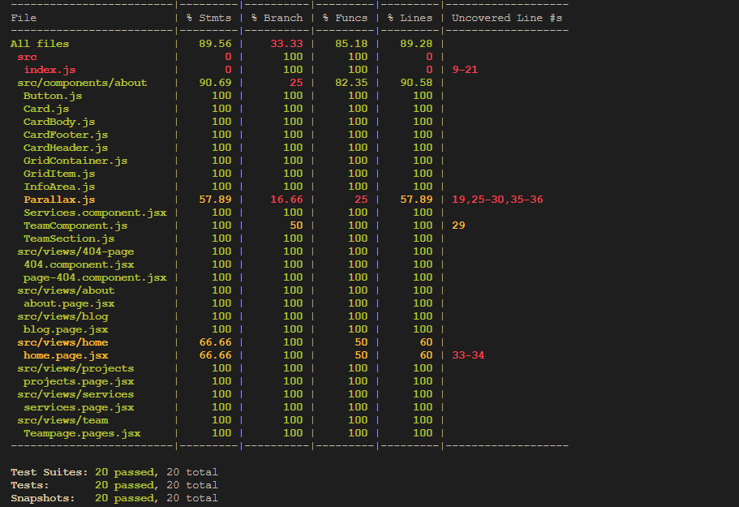
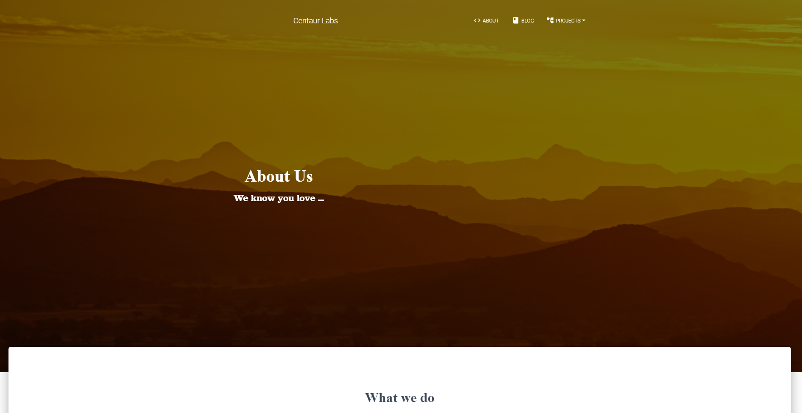
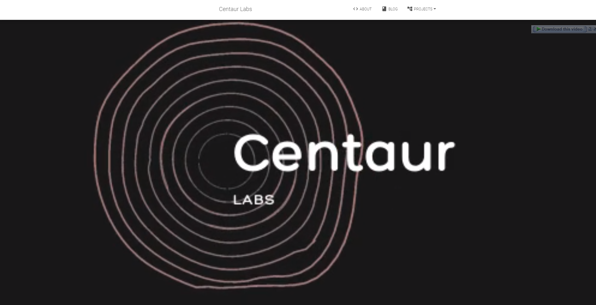
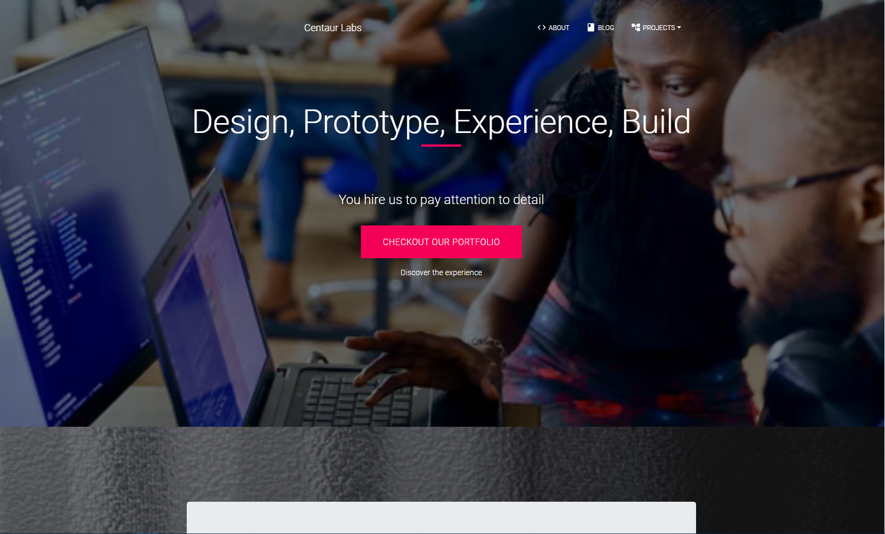
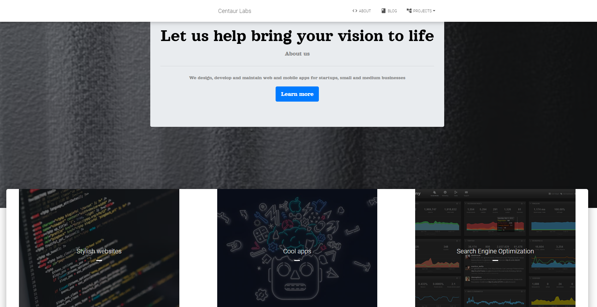
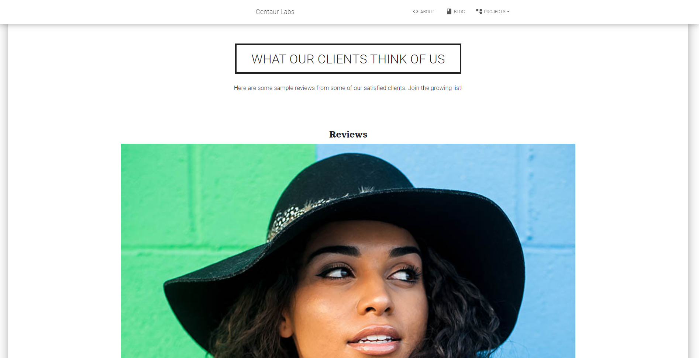
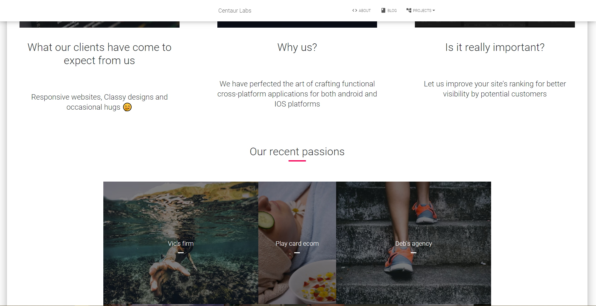
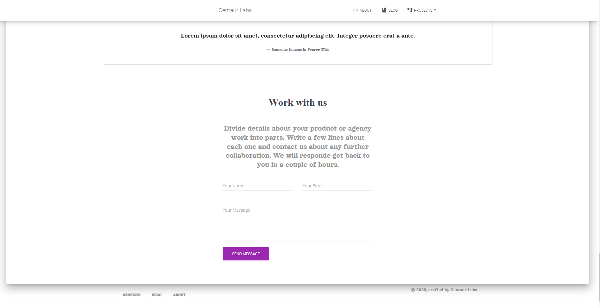

## Centaur

Centaur is a landing page made using React and Bootstrap(Reactstrap).

### Clone the project

> In your terminal run, `git clone git@github.com:iddle254/centaur.git `
> This command won't work if you have not configured your git to work with SSH. If you get an error, `git clone https://github.com/iddle254/centaur.git `

### Install dependencies

> `cd centaur ` then `npm i `.

### Run the app

> `npm start`

### Demo

> You can view the live site here ~ https://iddle254.github.io/centaur/

## **Docker support**

1. Make sure you have docker installed and running on your computer
2. Run `docker-compose up` ( you may have to run `docker-compose up --build` for the first setup phase)

## **Run the tests**

1. Run `npm run test` ( `npm test` should also work)

   > 
   > Coverage is decent but can still be improved.

# Issues

## **Routing issues(react-router-dom)**

### **About Page not working on update of react-router-dom from v4 to v6**

> #### Attempted fix **NO.1**

### Typical usecase

- Company landing page.
- 
- Ecommerce
- 
- Marketing template
- 

